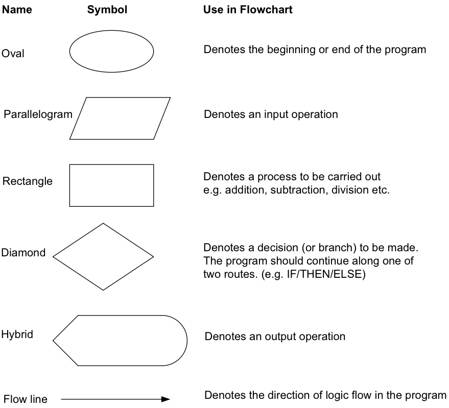

# GEOS 397/597 Lecture #11: Algorithms

## 1) Update from github

## 2) INTRODUCTION TO ALGORITHMS (3rd Edition)

	"Chapter 1 provides an overview of algorithms and their place in
	modern computing systems. This chapter defines what an algorithm is
	and lists some examples. It also makes a case that we should consider
	algorithms as a technology, alongside technologies such as fast
	hardware, graphical user interfaces, object-oriented systems, and
	networks."

---
From Deva Singh:

__A typical programming task can be divided into two phases:__
	
1) The problem solving phase

* produce an ordered sequence of steps that describe the solution of problem
* this sequence of steps is called an algorithm

2) Implementation phase 

* implement the program in some programming language

---
So we want to learn about the problem solving phase now. The other parts of this MATLAB class have focused on the Implementation stage up to now. We had been doing simple problems so we did not need to think about algorithms. Now we do. Let's discuss algorithms from the reading and then move on to some examples.

## Chapter 1: The role of algorithms in computing
	
### Section 1.1 Algorithms

Informally, an __algorithm__ is any well-defined computational procedure that takes some value, or set of values, as __input__ and produces some value, or set of values, as __output__. An algorithm is thus a sequence of computational steps that transform the input into the output.
	
We can also view an algorithm as a tool for solving a __well-specified computational__ problem. The statement of the problem specifies in general terms the desired input/output relationship. The algorithm describes a specific computational procedure for achieving that input/output relationship.

## 3) Steps in the problem solving phase (i.e. designing algorithms)

1) Outline the algorithm (one can use _pseudo code_ and/or _flowcharts_).

2) Create a step-by-step detailed _algorithm_ that is very close to a computer language.

* _NOTE: Pseudo code is an artificial and informal language that helps programmers develop algorithms. Pseudo code is very similar to everyday English._

#### A) Algorithm flowcharts

[An example](https://youtu.be/lbBIKGpQqcY) to get us thinking about algorithms and flowcharts.

#### B) Pseudocode

__Definition:__ Pseudocode 1) is a notation resembling a simplified programming language, used in program design; 2) is an informal high-level description of the operating principle of a computer program or other algorithm.

Pseudocode even has its own [wikipedia page](https://en.wikipedia.org/wiki/Pseudocode) 

Pseudocode [examples](http://www.unf.edu/~broggio/cop2221/2221pseu.htm)

Example 1)

	If student's grade is greater than or equal to 60

		Print "passed"
	else
		Print "failed"

Example 2) 

	Initialize total to zero

	Initialize counter to zero

	Input the first grade

	while the user has not as yet entered the sentinel
		
		add this grade into the running total
		add one to the grade counter
		input the next grade (possibly the sentinel)
		
	if the counter is not equal to zero
		
		set the average to the total divided by the counter
		print the average
		
	else

		print 'no grades were entered'

#### C) Flowcharts

__Definition:__ Flowchart 1) is a schematic representation of a sequence of operations, as in a manufacturing process or computer program; 2) is a graphical representation of the sequence of operations in an _information system_ or _program_. _Information system_ flowcharts show how data flows from source documents through the computer to final distribution to users. _Program_ flowcharts show the sequence of instructions in a single program or subroutine/function.

Student task: search Google Images for "flowchart symbols computer programming". What do you find?

Here is a good [site](http://www.wiley.com/college/busin/icmis/oakman/outline/chap05/slides/symbols.htm).

__A flowchart should do the following:__

* idenfity the logic in an algorithm
* emphasize indivdiual steps and their interconnections
* show the control flow from one action/process to the next

---

Different symbols are used to draw each process type in a flowchart. Common symbols include:

---

We commonly need to make decisions. Let's look at __decision structures__.

The expression (A > B) is a logical expression; it describes a condition we want to test. We then want to make a decision based on this logical exppression. For example, perhaps we want to use an __If-Then-Else structure__.

	if A>B is true (if A is greater than B) then we take the action on left

		print the value of A 

	if A>B is false (if A is not greater than B) then we take the action on right

		print the value of B

The flowchart for this particular decision process would look like the following.

---
	
#### D) Examples for students

Example 1) From Deva Singh:

Write an algorithm to determine a student’s final grade and indicate whether it is passing or failing. The final grade is calculated as the average of four marks.

Pseudocode:

	Input a set of 4 marks
	Calculate their average by summing and dividing by 4
	if average is below 50
		Print “FAIL”
	else
		Print “PASS”
Detailed algorithm:

	Step 1:	Input M1,M2,M3,M4
	
	Step 2:	GRADE = (M1+M2+M3+M4)/4 
	
	Step 3:	if (GRADE < 50) then
				Print “FAIL”
			else
				Print “PASS”
			endif

Flowchart:

---

Example 2) From [here](http://www.wiley.com/college/busin/icmis/oakman/outline/chap05/slides/pseudo.htm)

Pseudocode: this is the pseudocode for a Game of Monopoly, including one person's move as a procedure:

	Main Procedure Monopoly_Game
		Hand out each player's initial money.
		Decide which player goes first.
    	Repeat
       		Call Procedure Monopoly_Move for next player.
       		Decide if this player must drop out.
    	Until all players except one have dropped out.
    	Declare the surviving player to be the winner.

	Procedure Monopoly_Move
    	Begin one's move.
    	Throw the dice.
    	Move the number of spaces on the board shown on the dice.
    	If the token landed on "Go to Jail,"
        	then go there immediately.
    	Else if the token landed on "Chance" or "Community Chest,"
        	then draw a card and follow its instructions.
    	Else
        	follow the usual rules for the square (buying property,
        	paying rent, collecting $200 for passing "Go", etc.).
    	End one's move.

Detailed algorithm:

	None for now

Flowchart:

---

## 4) Design methods

There are different approaches to algorithm construction. The following was taken from [here](http://www.wiley.com/college/busin/icmis/oakman/outline/chap05/slides/design.htm).

__Structured Design Methods__

* Top-down design -- specify the solution to a problem in general terms, then divide the solution into finer and finer details until no more detail is necessary.
* Modularization -- helps a programmer to break a complex program into smaller subprograms called procedures.
* Module -- a set of instructions that can be tested and verified independently of its use in a larger program.

__More on top-down design:__

From [__Wikipedia__](https://en.wikipedia.org/wiki/Top-down_and_bottom-up_design): Top-down approaches emphasize planning and a complete understanding of the system. It is inherent that no coding can begin until a sufficient level of detail has been reached in the design of at least some part of the system. _(Top-down approaches are implemented by attaching the stubs in place of the module. This, however, delays testing of the ultimate functional units of a system until significant design is complete.)_ 

Bottom-up emphasizes coding and early testing, which can begin as soon as the first module has been specified. _(This approach, however, runs the risk that modules may be coded without having a clear idea of how they link to other parts of the system, and that such linking may not be as easy as first thought.)_ Re-usability of code is one of the main benefits of the bottom-up approach.

__More on Modularization:__

From [__Wikipedia__](https://en.wikipedia.org/wiki/Modular_programming): Modular programming is a software design technique that emphasizes separating the functionality of a program into independent, interchangeable modules, such that each contains everything necessary to execute only one aspect of the desired functionality.

## 5) Student Task

__A)__ On a piece of paper, write an algorithm that takes two values, determines the largest value, and prints the largest value with an identifying message. Include the following 3 items.

* The pseudocode
* The flowchart
* The detailed algorithm

__B)__ On a piece of paper, write an algorithm to calculate the roots of a quadratic equation. Include the following 3 items.

* The pseudocode
* The flowchart
* The detailed algorithm

_Hint: $d = \sqrt{b^2-4ac}$, and the roots are $$x1 = (-b+d)/2a$$ and $$x2 = (-b-d)/2a.$$ Think about the functions we saw in L09 and L10._

---
_NOTE: A lot of material in this lecture was taken from "The Computer Triangle" by Robert L. Oakman. The online version of the book can be found [here](http://www.wiley.com/college/busin/icmis/oakman/home.htm)._
